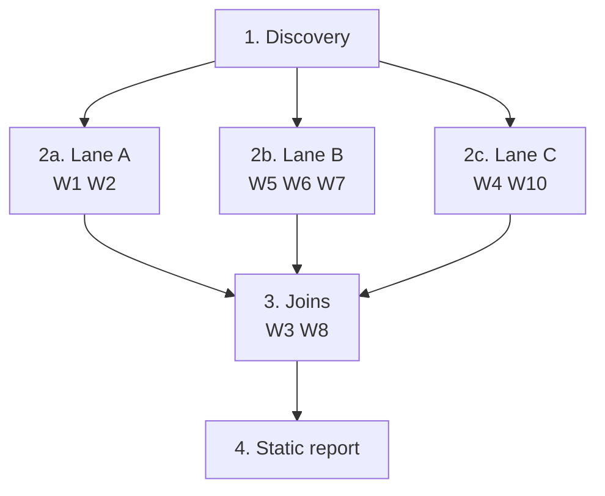
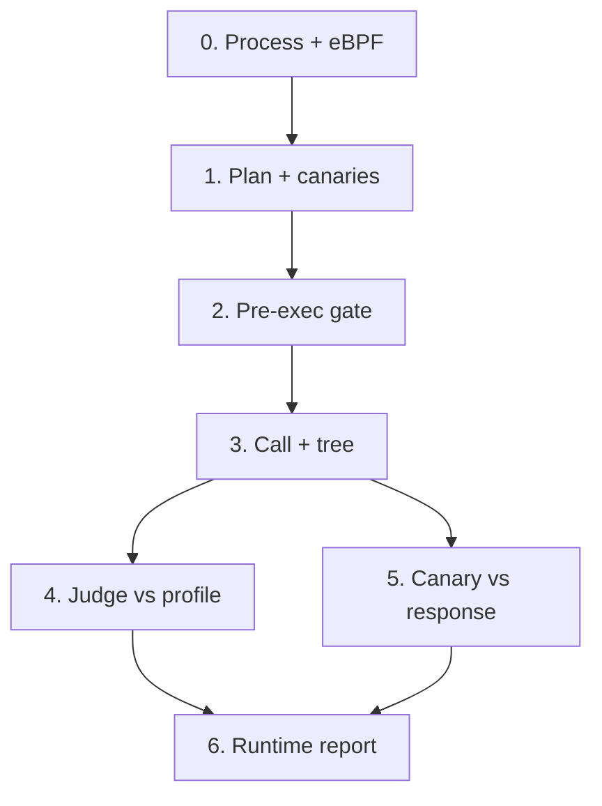

# MCPAegis

MCPAegis is a CLI and terminal UI for security analysis of local MCP (Model Context Protocol) servers. MCP servers list tools (named functions with JSON Schema arguments) that an agent can call. MCPAegis does not sit in that agent loop. It audits the server. It covers what the tool listing claims, what the code can do, and what actually happens when a tool is invoked.

The resulting vulnerabilities I find are grouped into distinct weakness categories (W1 through W10). I mention how I came up with these below. The tool uses both static analysis and dynamic analysis to gather evidence on the presence of those weaknesses.

Package and command is mcpaegis. It requires Python 3.11 or newer.

1. [Demo](#demo)
2. [How I got here](#how-i-got-here)
3. [What you need](#what-you-need)
4. [Two modes of operation](#two-modes-of-operation)
5. [With or without a model](#with-or-without-a-model)
6. [Key terms and concepts](#key-terms-and-concepts)
7. [Weakness catalog](#weakness-catalog-w1-w10)
8. [Capability catalog](#capability-catalog-c1-c12)
9. [Static analysis](#static-analysis)
10. [Dynamic analysis](#dynamic-analysis)
11. [Merge and display](#merge-and-display)
12. [Required on Mac](#required-on-mac)
13. [Setup](#setup)
14. [Tests and fixtures](#tests-fixtures-ground-truth-vs-observed)

---

## Demo

https://drive.google.com/file/d/1fySmDTx81ju_HWx_aYx7hUbinApp6C3z/view?usp=drive_link
---

## How I got here

As expected, the topic of local MCP server security testing is sparsely explored. Being an AI security researcher, I started off and spent a large chunk of my time in literature review on similar solutions to the same problem and I found the following 7 papers. I also mention what I inherited or got inspired by from each of them. I would recommend coming back to this section once the core functioning of the product is understood.

1. mcp-sec-audit (arXiv 2603.21641)

   Gave me the capability framing. It maps code level indicators onto named capability families rather than raw CWE buckets, and it pairs a static rulebook with a Docker plus eBPF runtime monitor. I took the idea that "what can this tool do" should be a first class descriptive layer separate from "what is wrong with this tool," which is why C1 through C12 exist as tags and W1 through W10 exist as findings. Its GitHub repo also confirmed a design detail the paper skipped, which is that confidence should be tracked as a tier (potential, confirmed, runtime only) rather than a boolean.

2. MCP-SandboxScan / SandScope (arXiv 2601.01241)

   Reframed what counts as a security sink. Classic SAST (static application security testing) treats a dangerous function call as the sink. SandScope argues that for agent safety the real boundary is the LLM visible MCP response field, since that is where leaked data actually reaches the model. It also plants unique canaries in environment variables, files, and tool arguments, then looks for them (including encoded variants) in the response. Stage 5 canary detection for W10 comes straight from this. Its declared capability profiling also shaped how Lane A derives declared capabilities from tool name and schema argument names.

3. MCP at First Glance (arXiv 2506.13538)

   The reality check on prevalence. It scanned 1,899 real servers with SonarQube plus mcp-scan and found credential exposure to be the single most common vulnerability class. That is why static W10 exists as its own detector and runs in the inventory lane with no dependency on Semgrep, the tool list, or an LLM. It also established that generic SAST alone misses MCP specific issues, which justified building MCP aware detectors instead of wrapping an existing scanner.

4. MCPZoo (arXiv 2607.11086)

   The reason I do not trust scanner output by default. It ran eight popular MCP scanners across roughly 37,000 runnable servers and found that 96.89% of servers got flagged by at least one scanner while manual validation confirmed only 45.53% as true positives, with average pairwise agreement between scanners of 15.66%. That pushed me toward evidence grounded findings, where a static suspicion is labeled as such and gets upgraded only when runtime actually corroborates it. The tier column in the merged report exists because of this paper.

5. FlowGuard (arXiv 2607.14754)

   Contributed two things. First, its lifecycle framing (tool discovery, tool invocation, response consumption) is the layering my catalog uses, which is why W1 and W2 live in the tool listing (name, description, schema, what the agent can read before any call), W5 through W8 are code level, and W9 and W10 land at execution and response level. Second, its triage step ranks tools by risk tokens in parameter names and descriptions before spending any budget on them. My invocation planner ranks the same way, so --max-calls spends its calls on the tools most likely to matter.

6. MTGuard (arXiv 2607.25297)

   The closest thing to a reference architecture for the runtime half. It runs the tool in a container with host side eBPF, attributes events by cgroup, and organizes everything into a behavior tree rooted at the invocation. Three things came from it directly. The cgroup filtered eBPF capture with the seven tracepoints. The single behavior tree per call, so process, file, and network events are attributed to the call that caused them rather than dumped in a flat log. And the pre execution audit that deliberately strips the free text description before deciding anything, on the grounds that the description is exactly what an attacker controls. W9 is its Tool Call Hook category, generalized. The pre execution gate stays code only for the same reason.

7. Corvus (arXiv 2608.00150)

   The odd one out since it scans internet facing servers and I scan local trees. What I borrowed is presentation. It maps every test module to a named taxonomy, scores confidence explicitly, and emits SARIF 2.1.0 so results land in existing tooling. The SARIF writer and --fail-on flag follow that pattern.

I also folded in the OWASP MCP Top 10 and Invariant mcp-scan's issue codes when coming up with the weakness taxonomy. Categories that belong to a different product got cut, so OWASP's Shadow MCP Servers is an asset inventory problem and Lack of Audit and Telemetry is something this tool produces rather than detects. Denial of service was dropped for the same reason Corvus excluded it from active testing. What survived is W1 through W10.

### Where the fixtures come from

Ground truth is the hard part. None of the public benchmarks are labeled against my catalog, so tests/fixtures/ is mostly my own, built as matched pairs where one tree should fire a specific ID and a lookalike tree should not.

Several fixtures are reconstructions from [appsecco/vulnerable-mcp-servers-lab](https://github.com/appsecco/vulnerable-mcp-servers-lab) (MIT), stripped of install time network calls, real keys, and HTTP bind. That lab covers path traversal, eval based RCE, typosquatting, outdated dependencies, and embedded secrets, which maps onto W5, W6, W4, and W10. malicious_tools_adapted and workspace_actions are the most direct adaptations.

The negative fixtures are mine and they are the ones that matter most. unrelated_cleanup exists because reachability does not imply inherent risk (taint), so a tool that calls a helper containing a hardcoded rm must not be flagged for command injection. name_collision exists because a same named function in an unrelated module must not become a taint source, which is why generated taint rules are file scoped. sanitized_shell exists to test whether Semgrep honors shlex.quote. indirect_prompt_injection is a deliberate negative, since hidden text in a response body is out of scope for a source auditor.

---

## What you need

To keep the first version complete and usable on one machine, MCPAegis makes a small set of platform choices. Those choices are deliberate, not a hard ceiling. The same pipelines can be extended to Windows and other hosts later without changing the weakness catalog or report format.

- macOS on Apple Silicon is the supported desktop path (macOS 13.5 or newer). Static analysis runs on the Mac. Runtime analysis runs inside a Lima Ubuntu 24.04 ARM64 guest because eBPF needs a Linux kernel.
- Linux (stock kernel, cgroup v2, BCC) can run static and runtime in-process. No Lima.
- Python 3.11 or newer (Homebrew python3.11 on Mac. Default python3 is often too old).
- A local MCP server path (source you can read). MCPAegis does not fetch remote MCP servers over the network as the audit target.
- An OpenRouter API key if you want the LLM stages. Put it in a .env at the repo root or your current directory.

  ```
  MCPAEGIS_LLM_API_KEY=sk-or-...
  MCPAEGIS_LLM_BASE_URL=https://openrouter.ai/api/v1
  MCPAEGIS_LLM_MODEL=<an OpenRouter model id>
  ```

- Homebrew only if Lima is missing. The first Runtime / Full run may download an Ubuntu image (minutes). Guest eBPF uses passwordless sudo -n -E inside Ubuntu, not a Mac password.
- Optional static extras on PATH. Semgrep (taint and sinks), plus pip-audit / npm audit / osv-scanner / cargo-audit for supply-chain (W4). Missing tools skip that slice. The rest of static still finishes.
- Lima virtiofs only mounts your home directory. Paths already under ~ are used as-is. Paths outside ~ are copied to ~/mcpaegis-servers/<name>/ (.venv, node_modules, __pycache__, .git skipped). Static still scans the original path. Reports default to ~/mcpaegis-out/<server-name>/.
- No Docker. The server under test is a local process in a nested cgroup on Linux.

Windows, Intel Mac x86_64 guests, and extra Lima mounts are out of scope for this cut. The auditor / guest split is isolated in mcpaegis/lima/, so those platforms can be added later without rewriting static, dynamic, or merge.

---

## Two modes of operation

Static never executes tool bodies. It reads tool listings and source, then names weaknesses from that metadata, Semgrep sinks, and inventory.

Dynamic does call tools as a local process while eBPF watches that process tree, then confirms or adds findings from real syscalls, DNS, and the MCP response.

You can also run full, which is static then dynamic then merge.

## With or without a model

With a model (OpenRouter key set), Lane A uses the LLM for tool-poisoning (W1) and declared capabilities, Stage 4 uses the LLM as the runtime emitter, and the TUI asks the same model to rewrite the merged markdown into a short terminal report.

Without a model, analysis still runs. Static falls back to regex / keyword rules and never fails closed. Runtime Stage 4 uses the code verifier. Pre-execution deny/allow is always code-only.

---

## Key terms and concepts

Each pipeline is broken into stages, usually by which weaknesses they target. The words below show up in both static and dynamic, so I define them here before the catalogs.

1. Tool

   A named function the MCP server lists for an agent. The tool listing is the name, description, and JSON Schema the agent can read before any call.

2. Finding

   One weakness I named, with a tool, evidence, and a severity. A capability (C1 through C12) is not a finding. It is a tag for what the tool can do.

3. Sink

   A potentially dangerous function call in the source, where the called function leaves the current program's memory. Typical sinks run a shell, read or write a file, talk to the network, or evaluate code.

4. Taint

   Untrusted tool input (a parameter the agent can set) actually reaches that sink, not just that the sink exists somewhere in the file.

5. Semgrep

   The pattern matcher I use in static Lane B. I run it twice. A sink pass marks an API as proximate when the call appears. A taint pass marks it as direct when a tool parameter flows into that call. Only direct sinks become named W5, W6, or W7.

6. Canary

   A unique marker I plant in the process environment or a file during runtime. It is W10 only if that marker (or an encoded form of it) shows up in the MCP response.

7. eBPF

   A Linux kernel tracer. I use it to watch file, process, and network syscalls for the server process tree. On a Mac that tracer runs inside a Lima Ubuntu guest.

8. Severity

   How urgent a finding is, not how sure I am. Surety is the merge tier (static_only, runtime_confirmed, runtime_only).

   - CRITICAL

     The MCP tool can take over the host or steal high-value secrets with little extra work.

   - HIGH

     A real exploit path is present (injection, traversal, SSRF, leaked credentials) and should be fixed before this server is trusted.

   - MEDIUM

     A meaningful weakness exists but needs a specific setup or extra step to abuse.

   - LOW

     A hygiene or over-declaration issue that is worth tracking but is not an immediate exploit.

---

## Weakness catalog (W1-W10)

These are the categories under which each vulnerability can fall.

| ID | Name | Typical evidence |
| --- | --- | --- |
| W1 | Tool poisoning | Hidden instructions, jailbreak language, homoglyphs, base64 blobs, or cross-tool override text in the tool listing (name, description, schema) |
| W2 | Tool shadowing | Two tools with lookalike names after normalize / leet (code, not LLM) |
| W3 | Over-privileged / capability mismatch | Code sinks imply a capability the tool listing never declared (under_declared), or the reverse (over_declared, LOW) |
| W4 | Supply chain | pip-audit / npm audit / osv-scanner / cargo-audit CVEs. npm install scripts |
| W5 | Command / SQL injection | Tool parameter reaches shell_exec / db_query / eval. Runtime confirms a real shell child |
| W6 | Path traversal | Untrusted path reaches file_read / file_write. Runtime needs a real file open/write |
| W7 | SSRF | Untrusted URL reaches a fetch. Runtime needs a real host, not a placeholder string |
| W8 | Missing access control | Privileged sink with no auth-like function name on the call path (name heuristic) |
| W9 | Tool execution hijack | Runtime only. Privileged shell / net / creds that static never attributed to this tool |
| W10 | Credential exposure | Hardcoded secrets in source (redacted), and/or a planted env/file canary in the MCP response |

## Capability catalog (C1-C12)

Capabilities are descriptive tags, not findings. They answer what this tool can do. W3 diffs declared caps (from the tool listing name and schema) against code caps (from sinks). If nothing privileged is listed, the declared set is C12 only.

| ID | Name | What it means |
| --- | --- | --- |
| C1 | FS_READ | Filesystem read (file, path, directory) |
| C2 | FS_WRITE | Filesystem write, modify, or delete |
| C3 | SHELL_EXEC | Shell or process execution (subprocess, run_cmd). Not eval / code load |
| C4 | NET_OUTBOUND | Outbound network (url, fetch, http) |
| C5 | NET_INBOUND | Inbound network (listen, bind) |
| C6 | DB_ACCESS | Database access (sql, postgres). The argument name query alone is not this |
| C7 | CREDENTIAL_HANDLING | Tokens, secrets, passwords, API keys |
| C8 | BROWSER_AUTOMATION | Browser / Playwright / click automation |
| C9 | CLOUD_SAAS | Cloud or SaaS (aws, gcp, s3, stripe) |
| C10 | CODE_REPO | Git / repo / commit operations |
| C11 | PROMPT_PROVIDING | Prompt or template providing |
| C12 | BENIGN_UTILITY | Nothing privileged listed. No external effect |

---

## Static analysis

Static never calls the tools. It answers what tools exist, what the listing claims, what the source can do, and whether those views disagree.

The static pipeline is 4 steps. Discovery, then three parallel lanes (A/B/C), then joins, then the report. Order lives in mcpaegis/static/pipeline.py.



### 1. Discovery

- Infer language from pyproject.toml / requirements.txt / package.json / Cargo.toml (or file suffixes).
- Infer the entrypoint as the shell command that would start the server (python server.py, node dist/index.js, and similar).
- Prefer a live stdio handshake. Spawn that command, send MCP initialize then tools/list (also resources/prompts). Child stderr is discarded so a noisy server cannot deadlock the pipe.
- If handshake fails, fall back to AST / grep for @mcp.tool() / server.tool("name"). Same goal, worse fidelity (empty schemas). A decorator scan still attaches file and line onto live tools so taint sources are file-scoped handlers.

### 2a. Lane A (checks W1 and W2)

- One LLM pass per tool when a key is set, covering poisoning criteria and declared capabilities. No key or bad JSON falls back to regex / keyword.
- W1 looks for jailbreak / hidden-instruction wording, cross-tool override text, long base64, and homoglyphs. Naming another tool in explanatory prose is not W1.
- Declared capabilities come from tool name plus schema argument names, not incidental docstring words (query is not database. sql is).
- W2 stays code. Normalize / leet name collisions (read_file vs read-file). Package typosquats are not W2.

### 2b. Lane B (identifies sinks, W5, W6, and W7)

Lane B uses Semgrep as described in Key terms. Two runs, then a union.

Only direct sinks with a tool_name become named W5 (shell / SQL / eval), W6 (file), or W7 (network). Proximate sinks still feed W3, W8, and the expected-behavior profile. Missing semgrep gives an empty sink list. Static still finishes.

### 2c. Lane C (W4 and W10, software supply chain)

- Tree only. No LLM, no Semgrep, no tool list required.
- Static W10 walks source (skipping .venv, node_modules, binaries) with gitleaks-style regexes. Snippets are redacted. This is the author already wrote a key into the repo, not a planted canary.
- W4 wraps pip-audit / npm audit / osv-scanner / cargo-audit if they are on PATH, plus LOW W4 for npm preinstall / postinstall hooks even with no CVE. Do not npm install the supply-chain fixture unless you intend to.

### 3. Joins (W3, W8)

- W3 diffs Lane A declared caps against Lane B code caps. under_declared is the dangerous direction (hidden power). over_declared is LOW leftover. BENIGN_UTILITY is ignored in the declared set.
- W8 needs sinks only. Privileged types (shell_exec, file_write, db_query, credential_read) with no require_auth / check_permission-style name on the reverse path. Name heuristic, not a proof of missing auth.
- --categories W1,W3,... skips matching detectors, not the whole pipeline.

### 4. Static report

- Writes static-report.json / .sarif / .md.
- Builds per-tool expected behavior profiles (declared caps, code caps, sink ids, known flags) for the runtime judge.
- Static-only IDs that typically never need a syscall are W1, W2, W4, W8, and regex W10.

---

## Dynamic analysis

Dynamic answers whether the process tree, DNS, and response match the static profile when I actually call the tool, and whether planted canaries leaked.

The dynamic pipeline is 7 steps (0 through 6). Launch and eBPF, plan calls and plant canaries, pre-exec gate, one filtered behavior tree, judge vs static profile, canary vs MCP response, then the runtime report.

On Apple Silicon, mcpaegis runtime and mcpaegis full start Lima automatically, run runtime in the guest, then merge locally. On Linux they run in-process. Darwin is the wrong kernel for BCC, and Docker Desktop's LinuxKit VM does not count.



### 0. Process, cgroup, eBPF

- Popen starts the MCP server in the Lima guest (or on Linux) with cwd set to the server tree and stdio piped for NDJSON.
- A nested cgroup mcpaegis-<pid>-<ts> is created and the server PID is written to cgroup.procs. Children inherit. BPF keeps events only when bpf_get_current_cgroup_id() matches that inode.
- Events cover file open/read/write/unlink, connect, exec/fork, and DNS. Loader paths and loopback are dropped later as noise.
- If Linux / cgroup v2 / BCC is missing, runtime exits 1. full warns and writes a static-only combined report.

### 1. Invocations and canaries

- --test-script (YAML/JSON) wins per tool, otherwise schema auto-fill (path becomes /tmp/mcpaegis-placeholder-path, other strings become mcpaegis-placeholder). Rank by risk tokens. --max-calls caps the list.
- An env canary (MCPAEGIS_CANARY_ENV) is set on the process. A file canary is written to out/canaries/secret.canary. Neither is passed as a tool argument.
- A canary hit is W10 only if that unique marker (or base64 / hex / rot13 of it) appears in the MCP response.
- Canaries are test dye, not your .env.

### 2. Pre-execution audit

- Code-only regex on argument values, covering sensitive paths, rm -rf /, curl | sh, and similar.
- Deny skips tools/call. This is not a weakness ID and there is no LLM on this path.
- Example. auto path=/etc/passwd is denied. Test-script command=echo hello is allowed.

### 3. One filtered behavior tree

- While the call runs, the monitor captures events for it. Filter noise first (loader libs, .so, loopback), then build a single tree. Nodes are from the capability list.
- PROC_EXEC / FORK become process nodes, connect / DNS become the network branch, and file events hang off the issuing pid.
- Filter is cgroup, not this call's child only. The long-lived server pid is in the tree.
- Example. run_cmd with echo hello should show /bin/sh or /bin/echo. eval(fmt) is in-process and must not look like a shell child.

### 4. Post-execution vs static profile

- Map the tree to observed capabilities (exec to shell, connect to net, sensitive paths to FS / credentials) and diff against the static profile.
- With a key, the LLM emits runtime evidence for W3 / W5 / W6 / W7 / W9 / W10. Static-only IDs (W1, W2, W4, W8) are stripped even if the model names them. Without a key, the code verifier is the fallback.
- Observed cap already in static known_flags becomes a confirm. Privileged cap not in declared or code becomes W9. Cap not seen on this one call is a mismatch, not a proof of absence.

### 5. Canaries

- Walks string leaves of the JSON-RPC result against env and file seeds only.
- If the process reads the canary and never puts it in the MCP result, Stage 5 is silent (eBPF might still show a file read).

### 6. Runtime report

- Writes runtime-report.json / .sarif / .md.
- Confirmed W5/W6/W7/W3 are HIGH. W9 and canary W10 are CRITICAL.

---

## Merge and display

mcpaegis full (and the TUI Full path) unions static and runtime into one finding list. That list is the result.

| Tier | Meaning |
| --- | --- |
| static_only | Named from source / metadata. Runtime did not (or need not) confirm. Typical W1, W2, W4, W8, regex W10 |
| runtime_confirmed | Same ID in static and the behavior tree or canary |
| runtime_only | Runtime evidence with no static counterpart (W9, canary W10, extra W3) |

On macOS, static stays on the Mac so Semgrep is not lost under guest sudo secure_path. Runtime runs in Lima. Merge happens locally. After each Runtime / Full run the VM is stopped (disk and guest venv kept) so host RAM/CPU are freed.

When you use the TUI with a model, MCPAegis then sends the merged markdown to the LLM and streams a rewritten report into the terminal, starting with a severity legend in plain language, then every finding kept (id, tool, evidence). Without a model, you get the structured markdown / JSON / SARIF writers as-is. Re-render later with mcpaegis report.

---

## Required on Mac

This cut targets Apple Silicon. Read this before Setup.

### Machine

- Apple Silicon Mac (M1, M2, M3, or M4). Intel Macs are out of scope.
- macOS 13.5 or newer.
- Git, to clone the repo.
- Python 3.11 or newer. Prefer Homebrew python3.11. System python3 is often too old.
- A local MCP server tree you can read. MCPAegis does not fetch remote servers. Repo fixtures count, for example tests/fixtures/command_injection.
- A terminal TTY if you want the wizard (bare mcpaegis).

### Runtime and Full

Static-only does not need these. Runtime and Full do.

- Homebrew. MCPAegis uses it only if limactl is missing. The first Runtime or Full run may brew-install Lima.
- Virtualization.framework allowed. macOS may prompt once.
- Disk and time for the first Ubuntu 24.04 ARM64 Lima image (minutes). Later runs reuse the VM disk.

You do not type a Mac sudo password. eBPF uses passwordless sudo -n -E inside the Ubuntu guest.

### Optional

- OpenRouter if you want LLM stages (Lane A W1, Stage 4 judge, TUI rewrite). Without a key, analysis still runs with regex and code fallbacks. Put a .env in the repo root or your current directory.

  ```
  MCPAEGIS_LLM_API_KEY=sk-or-...
  MCPAEGIS_LLM_BASE_URL=https://openrouter.ai/api/v1
  MCPAEGIS_LLM_MODEL=<an OpenRouter model id>
  ```

- pip install -e ".[static]" so Semgrep is in the venv (taint, W5 through W7). Missing Semgrep skips that slice. The rest of static still finishes.
- Supply-chain CLIs on PATH for W4. pip-audit, npm audit, osv-scanner, cargo-audit. Missing tools skip W4. Do not npm install tests/fixtures/supply_chain unless you mean to.

### Not required

- Docker
- A global mcpaegis on PATH. Activating .venv is enough.
- Extra Lima mounts. Home is mounted. Paths outside ~ are copied to ~/mcpaegis-servers/<name>/.
- Linux BCC on the Mac
- Intel or x86_64 guests

pip install -e puts mcpaegis in .venv/bin. source .venv/bin/activate puts that on PATH. New shells need activate again.

The first full run starts Lima (mcpaegis VM), may brew-install Lima and download Ubuntu, runs eBPF in the guest, then stops the VM (disk kept). Reports default to ~/mcpaegis-out/<server-name>/.

---

## Setup

```bash
cd /path/to/MCPAegis
python3.11 -m venv .venv
source .venv/bin/activate
pip install -e ".[dev]"
# optional but recommended for static taint
pip install -e ".[static]"
```

Create .env as shown above if you want OpenRouter. Process environment still wins over the file.

```bash
mcpaegis
```

Bare mcpaegis on a TTY opens the wizard, walking through mode, model on/off, path, optional test script, and run. First Runtime / Full may brew-install Lima and download Ubuntu.

Subcommands still work for scripts and CI (static on any OS. runtime on Linux, or via Lima on Darwin).

```bash
mcpaegis static ./tests/fixtures/poisoned_description --output ./out
mcpaegis runtime ./tests/fixtures/command_injection --test-script tests.yaml --output ./out
mcpaegis full ./tests/fixtures/command_injection --output ./out --fail-on HIGH
mcpaegis report ./out/combined-report.json --format html --output ./out
```

```text
mcpaegis                         # TUI
mcpaegis static <path> [--format json|sarif|md] [--output DIR] [--categories W1,W3,...] [--fail-on HIGH|CRITICAL] [--no-color] [--llm-model ...] [--llm-base-url ...]
mcpaegis runtime <path> [--test-script FILE] [--max-calls N] [--timeout SEC] [--format ...] [--output DIR] [--fail-on ...]
mcpaegis full <path> [union of the above]
mcpaegis report <results.json> --format html|md|sarif --output DIR
```

- full runs static, then runtime (auto-wires static-report.json), then merges.
- runtime uses <output_dir>/static-report.json when present, otherwise it warns and skips declared-vs-observed checks.
- --fail-on exits 1 if any finding is at or above that severity (CI).
- Guest fallback and failure modes live in [docs/lima-runtime.md](docs/lima-runtime.md). Semgrep rule authoring lives in [docs/rule-authoring.md](docs/rule-authoring.md).

### Precautions

- Fixtures are handshake-safe. Import plus initialize / tools/list do no I/O. Dangerous APIs stay in source so Semgrep can see them. Do not tools/call them on your machine unless you intend to (runtime does this inside the VM / cgroup).
- Do not npm install tests/fixtures/supply_chain unless you want to exercise audit. It has a postinstall hook.
- Auto-fill never passes the canary file path as an argument. Prefer an explicit test script for shells (command echo hello).
- Reports never store raw static secrets. Snippets are redacted.
- Nested cgroup + BCC need root in the guest. The Mac user does not type sudo for host Python.
- Intel Macs cannot use this ARM vz guest. Ubuntu 24.04 is the tested BCC/header combo.

---

## Tests, fixtures, ground truth vs observed

```bash
source .venv/bin/activate
pytest tests/unit tests/integration
```

Vendored trees live under tests/fixtures/. Each is a handshake-safe FastMCP (or JS) stub. Ground truth is the planted overall ID I expect in the combined report. Observed is what the latest Linux + LLM full run (out/full6) actually emitted. Extra stub W8 on a privileged sink with no auth helper is allowed.

| Fixture | Ground truth | Observed | Notes |
| --- | --- | --- | --- |
| poisoned_description | W1 | Correct | Jailbreak in summarize docstring. Innocent search |
| malicious_tools_adapted | W1 | Correct | Jailbreak moved into the docstring (adapted Appsecco lab) |
| tool_shadowing | W2 | Partial | W2 present. Extra LOW W3 on stubs (path vs no open) |
| overprivileged | W3 + W5 | Correct | Docs say search. Code subprocess.run(query, shell=True) |
| supply_chain | W4 | (static only) | JS stub + postinstall + pinned lodash. No server.py in the runtime loop |
| command_injection | W5 | Correct | run_cmd reaches shell=True. Runtime /bin/sh |
| eval_format | W5 | Correct | eval(fmt) static W5. Runtime correctly does not re-emit (no execve) |
| workspace_actions | W6 + W5 | Partial | Planted file + eval present. Extra LOW W3 from name / eval taxonomy |
| path_traversal | W6 | Correct | Path(path).read_text |
| ssrf | W7 | Correct | requests.get(url). Runtime confirm needs http://example.com/ |
| missing_access_control | W8 + W5 | Correct | Declared shell, no auth helper |
| static_credentials | W10 | Correct | Hardcoded AKIA / demo key. echo does not leak canaries |
| indirect_prompt_injection | none | Correct | Hidden text is in the body, not metadata, so out of scope |
| unrelated_cleanup | W3, no W5 | Correct | Hidden hardcoded rm. Taint must not mark direct |
| sanitized_shell | no W5 | Partial | Runtime dropped W5. Semgrep can still flag shlex.quote + argv /bin/echo |
| name_collision | no W5 on MCP search | (not in runtime loop) | Unrelated search in other.py must not taint the tool |

Several fixtures are reconstructions of [appsecco/vulnerable-mcp-servers-lab](https://github.com/appsecco/vulnerable-mcp-servers-lab) (MIT), stripped of install-time network, real keys, and HTTP bind. [MCP-Tox](https://github.com/luoji12103/MCP-Tox) is an LLM-agent simulation and is not mapped here.

```bash
mcpaegis static ./tests/fixtures/eval_format --output ./out
```
